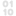

# Minos UUID Generator for Godot

A UUID generator for [Godot Engine](https://godotengine.org/), with 1.295×10^50 combinations it'll work for any sized game, never having to worry about running out of unique IDs! Automatically stores new UUIDs and removes old ones.

*NOTE: This is for Godot 4 only, and only supports GDScript as of right now (C# on the way!)*

## Features

- Custom node (UUIDManager) that stores the UUID
- Automatically generates UUID when node is created
- Automatically removes UUID when node is deleted
- (Optional) debug messages to make sure UUIDs are always working
- Easily create UUIDs at runtime, just need to instantiate the node and the rest is done automatically

## Installation

Copy the `addons/minos_uuid_generator` directory into your `res://addons/` directory.

## Documentation

- [GDScript](Documentation/GDScriptDocumentation.md)
- C# Coming soon!

## Contributors

Minos UUID Generator for Godot is made by Minoqi.

## License

Licensed under the MIT license, see `LICENSE` for more information.
